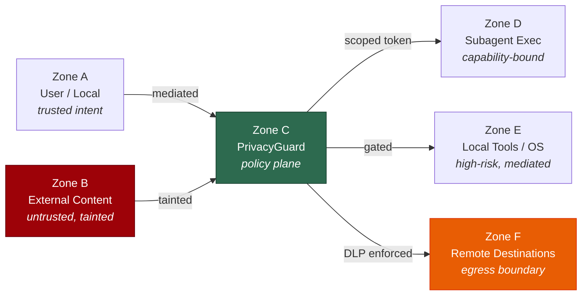
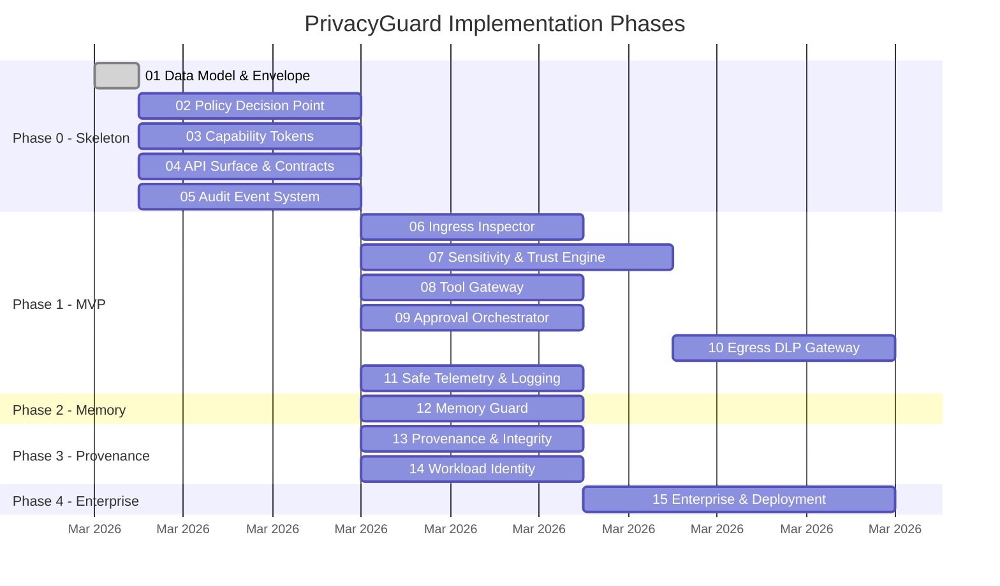

<div align="center">

# PrivacyGuard

**Zero-trust security, privacy, and DLP control plane for AI agent subagents**

[](https://www.typescriptlang.org/)
[](https://nodejs.org/)
[](https://zod.dev/)
[](https://vitest.dev/)
[](#license)

---

*Every subagent launch, tool call, memory write, remote model call, and outbound send must route through PrivacyGuard.*

</div>

## Overview

PrivacyGuard is a **mandatory** security, privacy, and DLP control plane for [OpenClaw](https://github.com/openclaw/openclaw) subagents. It sits between the user and all downstream execution surfaces — subagents, tools, memory, remote destinations — to enforce:

- **Zero-trust mediation** — no implicit trust, every action verified
- **Policy-as-code** — deterministic, auditable decisions via OPA/Cedar
- **DLP at every boundary** — PII/secret detection, redaction, and masking
- **Signed audit trails** — tamper-evident logs for every decision

## Architecture

Seven components form the control plane:

```
┌─────────────────────────────────────────────────────────────────────┐
│                        PrivacyGuard Control Plane                   │
│                                                                     │
│  ┌──────────────┐    ┌──────────────┐    ┌────────────────────────┐ │
│  │   Ingress    │ ─> │  Sensitivity │ -> │  Policy Decision Point │ │
│  │   Inspector  │    │  & Trust     │    │  (PDP)                 │ │
│  └──────────────┘    │  Engine      │    └──────────┬─────────────┘ │
│                      └──────────────┘               │               │
│                                           ┌─────────┼─────────┐     │
│                                           ▼         ▼         ▼     │
│                                   ┌──────────┐ ┌───────┐ ┌───────┐  │
│                                   │ Approval │ │ Tool  │ │ Memory│  │
│                                   │ Orch.    │ │ Gate  │ │ Guard │  │
│                                   └──────────┘ └───────┘ └───────┘  │
│                                          │         │         │      │
│                                          └─────────┼─────────┘      │
│                                                    ▼                │
│                                          ┌──────────────────┐       │
│                                          │  Egress DLP &    │       │
│                                          │  Audit           │       │
│                                          └──────────────────┘       │
└─────────────────────────────────────────────────────────────────────┘
```

| # | Component | Role |
|---|-----------|------|
| 1 | **Ingress Inspector** | Parse inbound content, classify trust/source, detect prompt injection |
| 2 | **Sensitivity & Trust Engine** | PII/secret detection, confidence scores, trust labels, data classes |
| 3 | **Policy Decision Point** | Evaluate allow/deny/redact/approve decisions via policy-as-code |
| 4 | **Approval Orchestrator** | User-facing prompts for high-risk flows, purpose-bound approvals |
| 5 | **Tool Gateway** | Scoped capability tokens, tool mediation, exec/fs/browser gating |
| 6 | **Memory Guard** | Ephemeral/quarantined/trusted memory tiers, promotion rules |
| 7 | **Egress DLP & Audit** | Outbound scanning, transforms (mask/tokenize/redact), signed audit events |

## Trust Zones



## Content Envelope

The `ContentEnvelope` is the canonical metadata wrapper for **all** content flowing through the system:

```typescript
interface ContentEnvelope {
  content_id:           string;           // UUIDv4
  source_type:          SourceType;       // user_input | local_file | web_content | ...
  source_trust:         SourceTrust;      // trusted_user | untrusted_external | ...
  sensitivity:          DataClass[];      // public < internal < confidential < restricted < pii < secret
  entities:             DetectedEntity[]; // PII/secret entities found in content
  retention_class:      RetentionClass;   // ephemeral | session | durable | quarantined
  allowed_destinations: Destination[];    // local_only | approved_remote | any_remote
  purpose_tags:         PurposeTag[];     // user_request | agent_task | audit | ...
  taint_flags:          TaintFlag[];      // contains_pii | contains_secret | prompt_injection_suspected
  provenance_ref?:      string;           // URL to provenance attestation
  created_at:           string;           // ISO 8601 datetime
}
```

Cross-field invariants are enforced at parse time — for example, `pii` sensitivity **requires** `contains_pii` taint, and `untrusted_external` content **cannot** have `durable` retention.

## Policy Effects

Every policy decision produces one of:

| Effect | Meaning |
|--------|---------|
| `allow` | Proceed with no restrictions |
| `allow_with_minimization` | Proceed, but strip/redact unnecessary sensitive data |
| `require_approval` | Block until user explicitly approves with purpose binding |
| `quarantine` | Isolate content for review; do not use in active flows |
| `deny` | Hard block with human-readable explanation and policy ID |

## Implementation Roadmap



### Progress

| Phase | Components | Status |
|-------|-----------|--------|
| **Phase 0** — Skeleton | 01 Data Model, 02 PDP, 03 Cap Tokens, 04 API Surface, 05 Audit Events | 1/5 |
| **Phase 1** — MVP Controls | 06 Ingress, 07 Sensitivity, 08 Tool Gateway, 09 Approvals, 10 Egress DLP, 11 Telemetry | 0/6 |
| **Phase 2** — Trust-Aware Memory | 12 Memory Guard | 0/1 |
| **Phase 3** — Provenance & Identity | 13 Provenance, 14 Workload Identity | 0/2 |
| **Phase 4** — Enterprise | 15 Enterprise & Deployment | 0/1 |
| **Cross-cutting** | 16 Test Strategy & Threat Modeling | Ongoing |

## Dependency Graph

```
01 Data Model ──┬──▶ 02 PDP ──────┬──▶ 06 Ingress Inspector
                │                 ├──▶ 08 Tool Gateway
                │                 ├──▶ 10 Egress DLP
                │                 └──▶ 12 Memory Guard
                ├──▶ 03 Cap Tokens ──▶ 08 Tool Gateway
                ├──▶ 04 API Surface (parallel with 02, 03)
                └──▶ 05 Audit Events (parallel with 02, 03)

07 Sensitivity Engine ──▶ 06 Ingress Inspector
                      ──▶ 10 Egress DLP

09 Approval Orchestrator ──▶ 02 PDP
                         ──▶ 08 Tool Gateway

11 Safe Telemetry ──▶ 05 Audit Events
13 Provenance ──▶ 05 Audit Events, 02 PDP
14 Workload Identity ──▶ 03 Cap Tokens
15 Enterprise ──▶ All Phase 0–3 components
16 Test Strategy ──▶ Runs in parallel from Phase 0 onward
```

## Quick Start

```bash
# Clone
git clone https://github.com/vvoffsec/PrivacyGuard.git
cd PrivacyGuard

# Install dependencies
npm install

# Run all checks (typecheck → lint → test → audit)
npm run check
```

### Development Commands

| Command | Description |
|---------|-------------|
| `npm run check` | Run all checks in sequence |
| `npm run typecheck` | TypeScript type checking (`tsc --noEmit`) |
| `npm run lint` | ESLint with strict type-checked rules |
| `npm run test` | Run all unit tests (Vitest) |
| `npm run format` | Auto-format with Prettier |
| `npm run audit:deps` | Check for dependency vulnerabilities |

## Tech Stack

| Category | Technology |
|----------|-----------|
| Language | TypeScript (ESM, ES2022, NodeNext) |
| Validation | Zod v4 — runtime validation + static type inference |
| Testing | Vitest v4 — native ESM, fast feedback |
| Linting | ESLint v10 + typescript-eslint (strictTypeChecked) |
| Formatting | Prettier |
| IDs | uuid v13 (UUIDv4) |

### Planned additions

| Category | Technology |
|----------|-----------|
| Authorization | OPA or Cedar-backed PDP |
| PII/Secret Detection | Pattern + checksum + entropy pipeline (Presidio-class) |
| Pseudonymization | Deterministic tokenization / FPE |
| Workload Identity | SPIFFE/SPIRE |
| Provenance | Signed bundles + in-toto / SLSA attestations |
| Observability | OpenTelemetry with source-side redaction |

## Non-Functional Targets

- **P95 PDP decision** < 100ms (text-only, normal local load)
- **P95 ingress classification** < 250ms (up to 64 KB text)
- **Fail closed** on PrivacyGuard failure (preserve last-known-good policy bundle)
- **Zero raw secrets** in routine logs (automatic secret-leak tests every release)
- **Every deny/redact/approval** returns human-readable explanation + policy ID

## Project Structure

```
PrivacyGuard/
├── docs/
│   ├── plans/
│   │   ├── 00-master-plan.md          # Master index + dependency graph
│   │   ├── 01-data-model-and-envelope.md
│   │   ├── 02-policy-decision-point.md
│   │   ├── ...                        # 03 through 16
│   │   └── 16-test-strategy-and-threat-modeling.md
│   └── PrivacyGuard_Technical_Architecture_Spec.pdf
├── src/
│   ├── data-model/                    # Plan 01 — ContentEnvelope
│   │   ├── __tests__/                 # 52 unit tests
│   │   ├── data-class.ts              # Data classification hierarchy
│   │   ├── entity.ts                  # Detected entity schema
│   │   ├── envelope.ts                # ContentEnvelope schema + parse/update
│   │   ├── errors.ts                  # Validation & consistency errors
│   │   ├── factories.ts              # Envelope factory helpers
│   │   ├── serialization.ts          # JSON serialization + integrity hashing
│   │   └── index.ts                   # Public API barrel
│   └── shared/
│       └── crypto.ts                  # SHA-256 hashing utility
├── CLAUDE.md
├── eslint.config.mjs
├── package.json
├── tsconfig.json
└── vitest.config.ts
```

## Contributing

This project is in active early development. To contribute:

1. Read the [architecture spec](docs/PrivacyGuard_Technical_Architecture_Spec.pdf) and the relevant [plan doc](docs/plans/) for the component you want to work on
2. Check the [dependency graph](#dependency-graph) to ensure prerequisites are complete
3. Create a feature branch — never push directly to `main`
4. Ensure `npm run check` passes before submitting a PR
5. All policy decisions must be deterministic and auditable — no probabilistic allow/deny

## License

TBD
